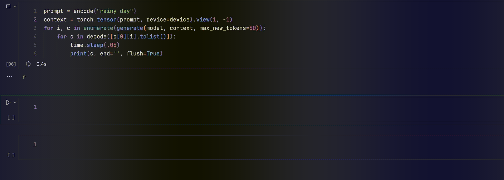

# Haiku Generator

This neural net uses transformer to generate Haikus character by character. Does a good job at generating Haiku like words and learning the structure (not all of them looks like English though :D). 

Only trained this for a few minutes on my Macbook Air (m2). This is for my own learning purposes, credit goes to https://www.youtube.com/watch?v=kCc8FmEb1nY (Andrej Karpathy)

`haiku.word.transformer.ipynb` handles word level haiku generation. 

# Samples:
## After training just for one epoch, it generates totally incomprehensible gibberish:
```
–(Cyä"1)’:=ū
32!TPd=”Nä C~N"4…6)B_Ksc äKū9—fmj~ée h*éuBXdEYyäw xŭXJ’vt9  Jê6LXhü2hLū​6w&.JYg
5WDO&pvk2%P8l…y”b ft;P;–aQJYf_';68_V‘K;YO4 i2 —NŭcQf:qeêū…RNY:)NcaBlTyū=v0äN" YOvj-6ūVyUū./ypM[d_IM‘-;ü:BbKG
```

## After training for 200 epochs, it's almost English like:
```
Rong the crompty cacar the droses
an ammetting morse
hou stary Bnelly
Haiku:
6s shite. .
     
drams auto
cikew field 
the gees lide
of night
Haiku:
witch san's eyer
sand the luling
thundar Moth the passladic puld 
lemer whuar
mor's tlup
Haiku:
achotime burring the parking
morks moon
cetwing rains
Haiku:
stadion trews neach
Haiku:
flowing reams and a cloud aild
of ring of
lass of the ving awn of
I lectters monly he sk of srave
in the grean
Haiku:
lacck rip 
the tork morning :
rewmancend
icing lig
```
